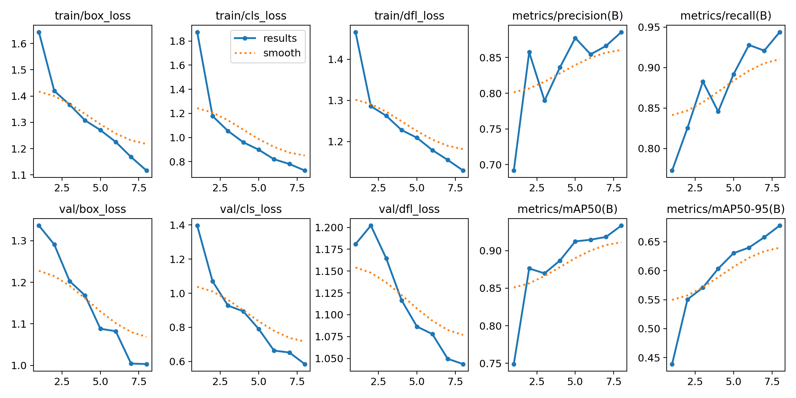
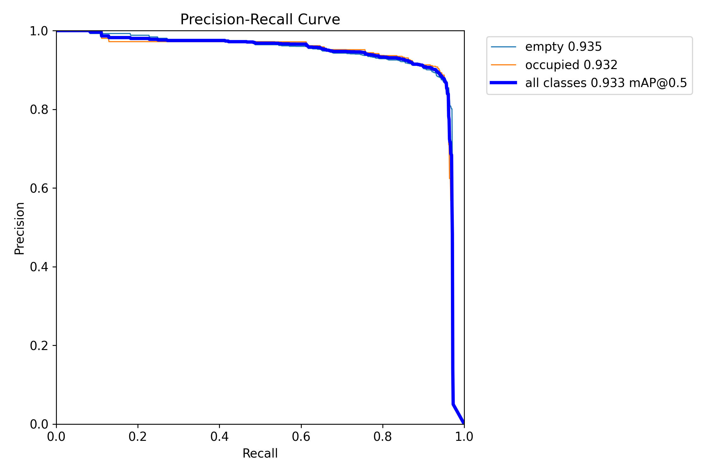
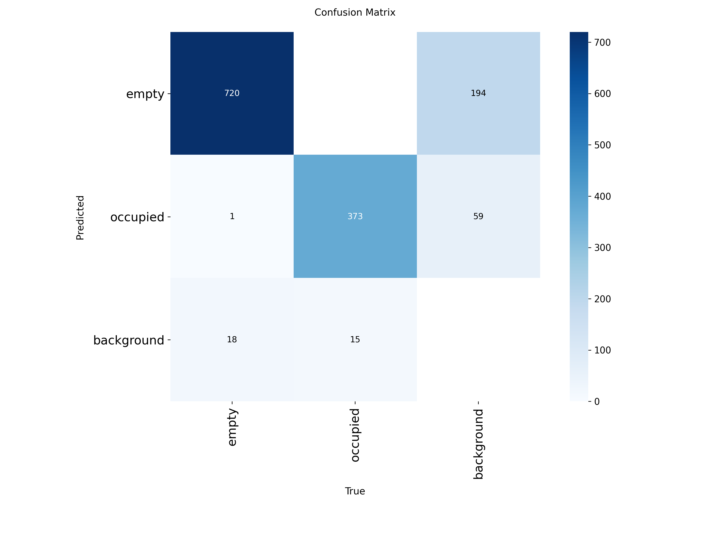
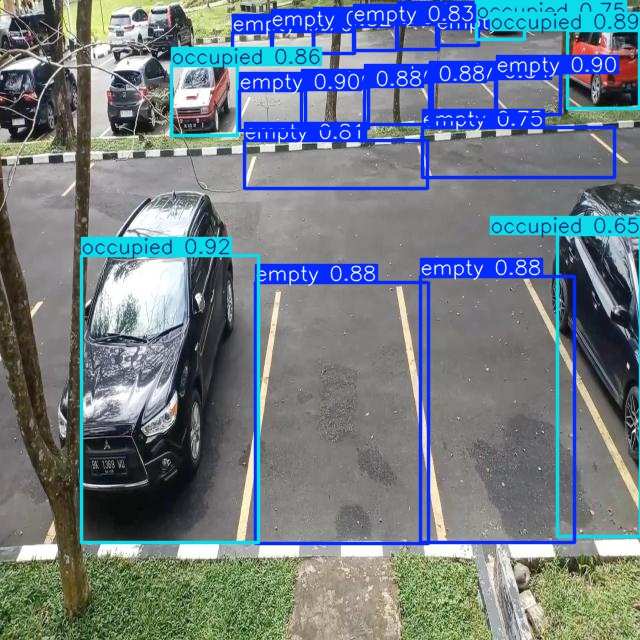
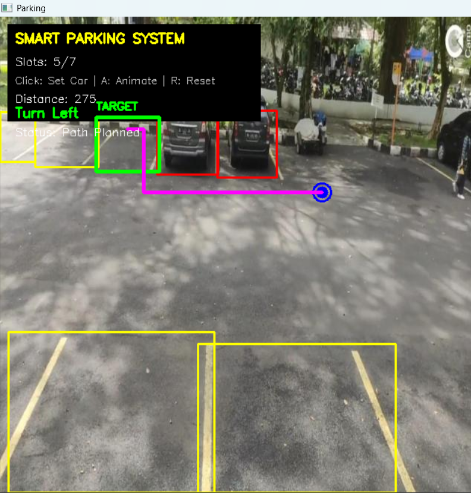
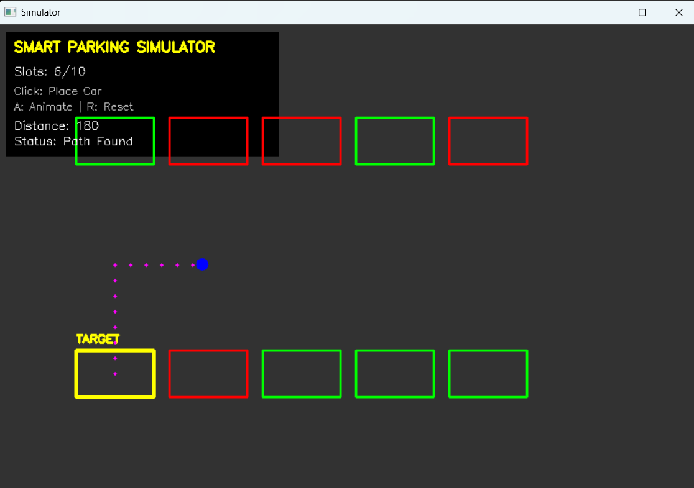

# SmartPark Vision 🚗

SmartPark Vision is an intelligent parking assistance system that combines **computer vision-based parking slot detection** with **path planning and A* navigation simulation**.

The project detects parking slots as **empty** or **occupied** using a trained YOLOv8 model and demonstrates parking navigation through:
- simple logic-based path planning on real parking images
- A* shortest-path navigation in a parking simulator

---

# 📌 Features

- Parking slot detection using YOLOv8
- Empty vs occupied slot classification
- Nearest empty slot selection
- Path planning on parking images
- Obstacle avoidance
- A* pathfinding simulation
- Interactive parking simulator
- Real-time visualization and navigation

---

# 🧠 System Workflow

```text
Parking Image
        ↓
YOLOv8 Detection
        ↓
Slot Classification
        ↓
Nearest Empty Slot Selection
        ↓
Path Planning
        ↓
Obstacle Avoidance
        ↓
Navigation Visualization
```

---

# 🗂️ Dataset

Dataset Used:  
Parking Space Dataset (Roboflow)

Dataset Link:  
https://universe.roboflow.com/muhammad-syihab-bdynf/parking-space-ipm1b

### Dataset Classes
- Empty Parking Slot
- Occupied Parking Slot

### Dataset Split

| Dataset | Images |
|---|---|
| Train | 1917 |
| Validation | 138 |
| Test | 23 |

---

# 🧹 Dataset Preparation

Minimal preprocessing was performed before training:

- Dataset organization
- Annotation verification
- Train/validation/test split
- Label consistency checking

YOLO internally handled:
- Image resizing
- Normalization
- Data augmentation

---

# 🤖 Model Training

A pretrained YOLOv8 Nano model (`yolov8n.pt`) was trained on the parking dataset.

### Training Parameters

| Parameter | Value |
|---|---|
| Model | YOLOv8n |
| Epochs | 8 |
| Image Size | 640 |
| Batch Size | 16 |

### Training Code

```python
from ultralytics import YOLO

model = YOLO("yolov8n.pt")

model.train(
    data="data.yaml",
    epochs=8,
    imgsz=640,
    batch=16
)
```

---

# 📈 Training Results

The trained model successfully learned parking-slot localization and occupancy classification.

### Training Metrics

#### Overall Training Results


#### Precision-Recall Curve


#### Confusion Matrix


---

# 🚗 Parking Slot Detection

The trained YOLOv8 model predicts:
- Parking slot bounding boxes
- Empty/occupied labels

Occupied slots are treated as obstacles during navigation.

### Detection Output


---

# 🛣️ Path Planning on Real Parking Images

A lightweight rule-based path planning approach was implemented for real parking images.

### Steps
1. Detect parking slots
2. Select nearest empty slot
3. Generate navigation path
4. Avoid occupied slots
5. Visualize final route

### Path Planning Output


### Why not direct A* on parking images?

Parking images contain:
- varying camera angles
- inconsistent lane structures
- perspective distortion

Due to this, direct grid-based A* navigation becomes unreliable on raw parking images.

Instead, a structured rule-based path planning approach was implemented.

---

# 🧭 A* Parking Simulator

A dedicated parking simulator was developed using OpenCV to demonstrate intelligent navigation and obstacle-free path planning.

The simulator:
- Generates parking layouts
- Marks occupied slots as obstacles
- Converts the environment into a grid
- Computes shortest paths using A*

### A* Formula

\[
f(n) = g(n) + h(n)
\]

Where:
- `g(n)` → actual distance traveled
- `h(n)` → estimated distance to target
- `f(n)` → total estimated cost

### Manhattan Distance Heuristic

\[
h(n) = |x_1 - x_2| + |y_1 - y_2|
\]

### Simulator Output


---

# 📊 Experimental Results

The system successfully:
- Detected parking slots
- Classified occupancy
- Generated navigation paths
- Avoided obstacles
- Simulated parking navigation using A*

### Observations
- YOLO achieved reliable parking-slot detection
- A* produced efficient obstacle-free routes
- The simulator provided consistent navigation behavior

---

# 📁 Project Structure

```text
smartpark-vision/
│
├── assets/
│   ├── detection/
│   ├── simulator/
│   └── training/
│
├── models/
│   └── best.pt
│
├── main.py
├── simulator.py
├── data.yaml
├── dataset_source.txt
├── test.jpg
├── README.md
└── .gitignore
```

---

# ⚙️ Technologies Used

- Python
- OpenCV
- NumPy
- YOLOv8
- A* Algorithm
- Heap Queue (`heapq`)

---

# ▶️ Installation

Install dependencies:

```bash
pip install ultralytics opencv-python numpy
```

---

# ▶️ Running the Project

## Run Parking Detection

```bash
python main.py
```

## Run Parking Simulator

```bash
python simulator.py
```

---

# 🚀 Future Scope

Possible future improvements:
- Real-time camera integration
- Dynamic obstacle handling
- Autonomous steering simulation
- Lane detection
- Full YOLO + A* integration
- Web dashboard/UI

---

# 👩‍💻 Author

Prachi

---

# 📜 License

Dataset License:  
CC BY 4.0
